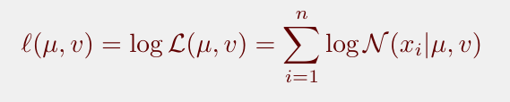
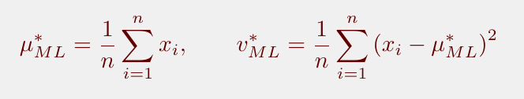
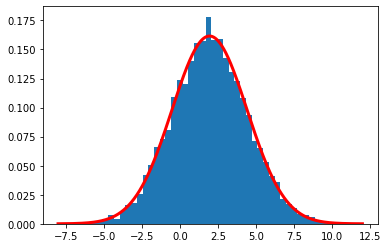
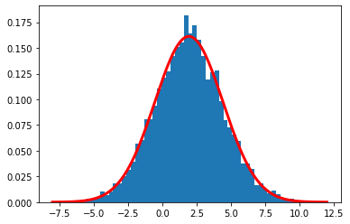
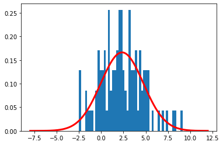

# Laboratory 4

In this lab we will focus on calculating probability densities and ML estimates. The mathematical formulations implemented and the results obtained will be presented below.

## Gaussian density estimation

The purpose of this section is to estimate the parameters of a Gaussian distribution using the **maximum likelihood estimation**

#### GAU_pdf(x, mu, var) function 

#### computeLikelihood(dataset, mu, var)

#### GAU_logpdf(x, mu, v)

The above expression for the total probability is actually quite a pain to differentiate, so it is almost always simplified by taking the natural logarithm of the expression. This is absolutely fine because the natural logarithm is a monotonically increasing function. This means that if the value on the x-axis increases, the value on the y-axis also increases. This is important because it ensures that the maximum value of the log of the probability occurs at the same point as the original probability function. Therefore we can work with the simpler log-likelihood instead of the original likelihood.

#### computeLogLikelihood(dataset, mu, v)

#### computeMaximumLikelihoodEstimates(dataset)

### Result

In this case we have a good fit of the histogram, and the density well represents the distribution of ourdata. 

Results with fewer samples are shown below. Respectively with 9000 samples, 5000 samples, 1000 samples and 100 samples.

## Multivariate Gaussian

In this section, The Multivarite Gaussian (MVG) will be implemented and the results will be compared with the data provided.

#### logpdf_GAU_ND(XND, mu, C) function

where x is a feature vector.
